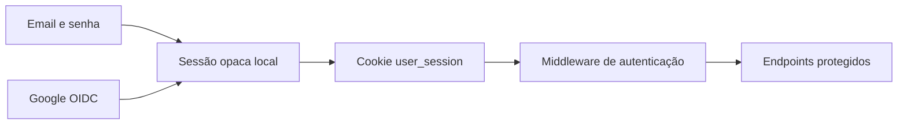
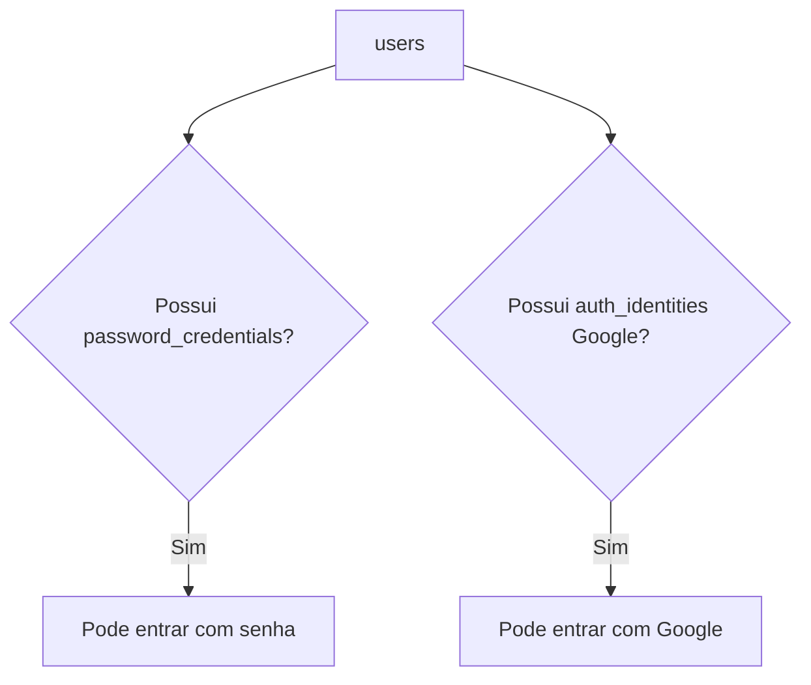
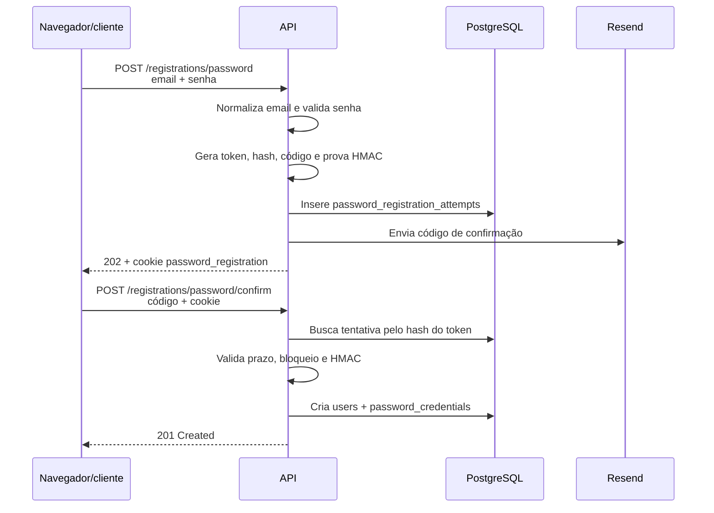
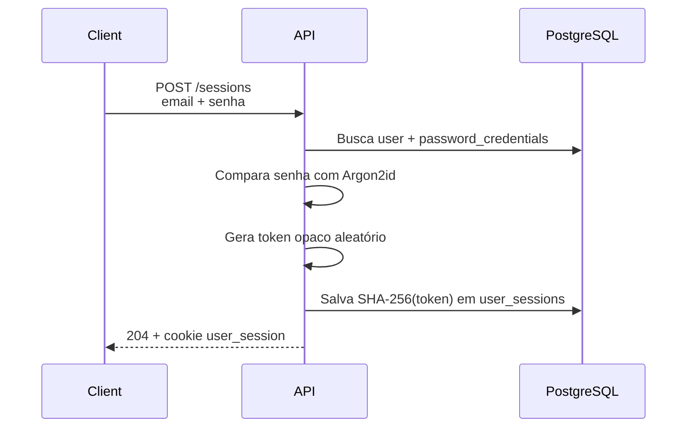
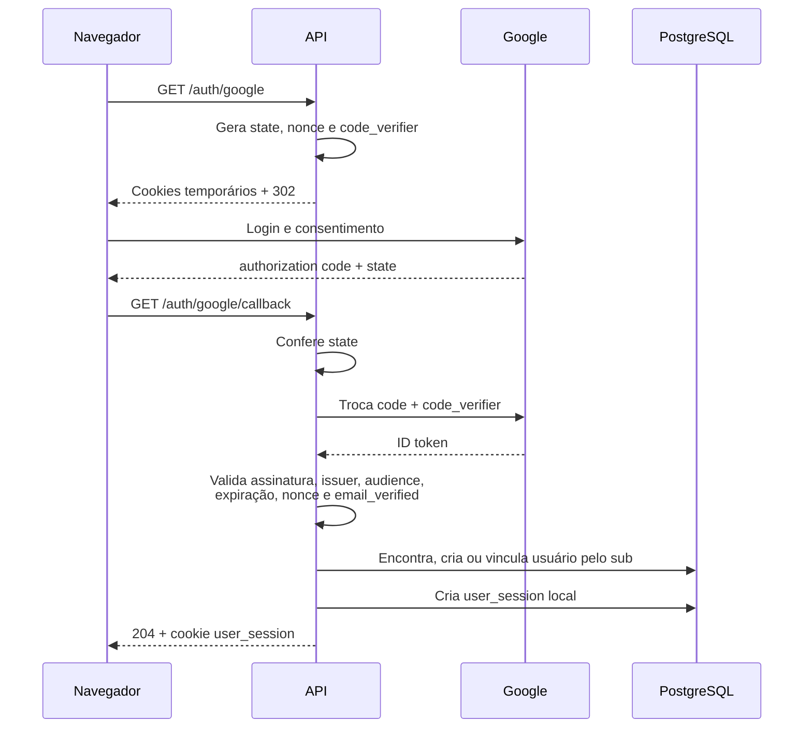
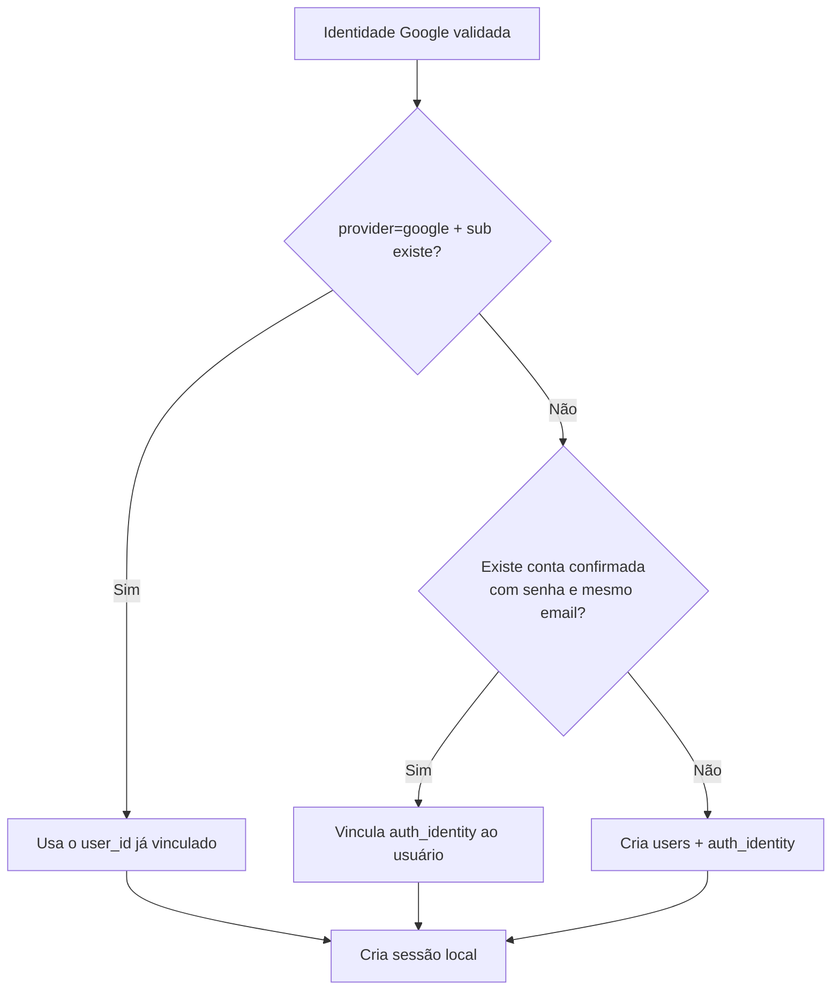
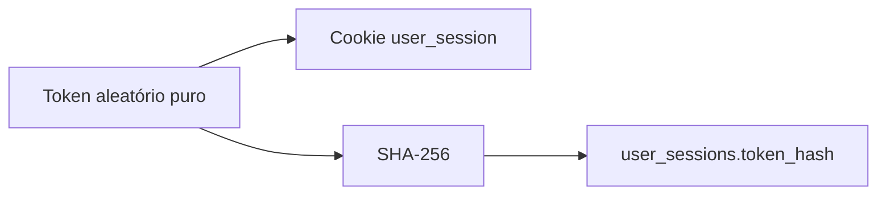
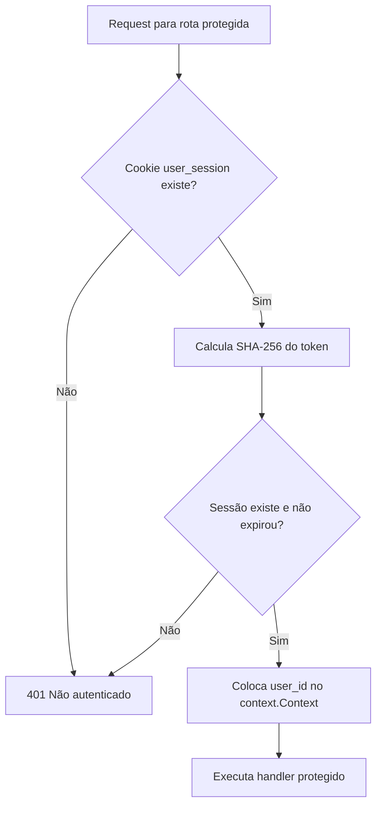
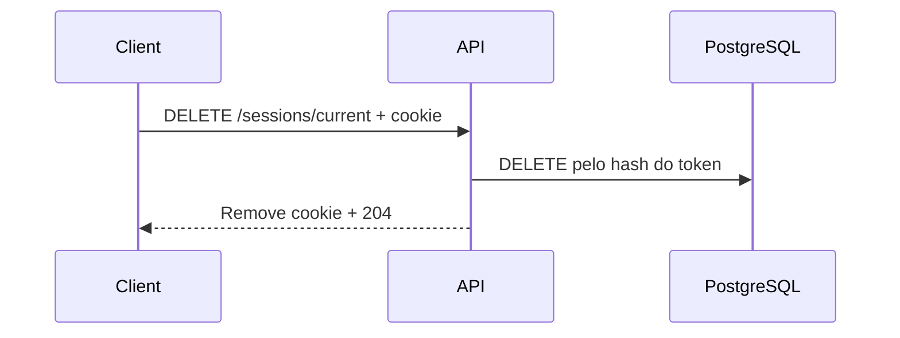
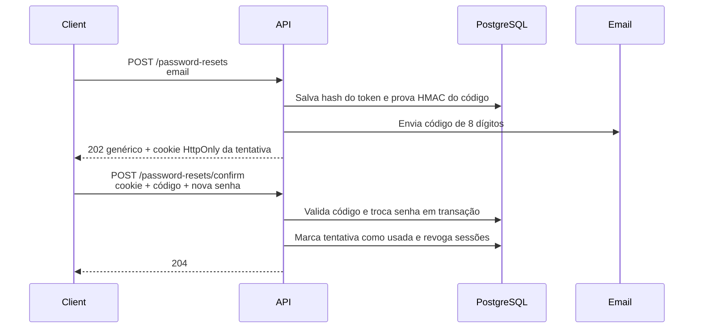

# Autenticação

> Status: cadastro e login concluídos; recuperação de senha em desenvolvimento
> Última atualização: 24 de setembro de 2026

## Visão geral

A aplicação aceita duas formas de login, mas ambas terminam na mesma sessão local:



A aplicação não emite JWT próprio. O ID token do Google é usado somente para comprovar a identidade durante o callback. Depois disso, Google e senha usam `user_sessions` no PostgreSQL.

## Modelo de conta



Um usuário pode ser:

| Tipo de conta | `password_credentials` | `auth_identities` |
|---|---:|---:|
| Somente senha | Sim | Não |
| Somente Google | Não | Sim |
| Senha vinculada ao Google | Sim | Sim |

Uma conta criada originalmente pelo Google não pode adicionar ou recuperar senha no MVP. Uma conta confirmada por senha pode ser vinculada automaticamente ao Google quando o Google comprova o mesmo email.

## Cadastro com senha ✅

O cadastro não cria imediatamente uma linha em `users`. Primeiro existe uma tentativa temporária.



### Por que existe um token e um código?

- O token identifica a tentativa específica e fica em cookie `HttpOnly`; somente seu SHA-256 é armazenado.
- O código chega por email e prova que a pessoa controla aquele endereço.
- A prova armazenada é `HMAC(token, código)`. O código puro não fica no banco.

### Prazos e proteção contra abuso

- código: 10 minutos por padrão;
- tentativa inteira: 30 minutos por padrão;
- reenvio: cooldown de 30 segundos;
- erro de código: espera de 30 segundos;
- a cada cinco erros: bloqueio de cinco minutos;
- reenvio gera outro código sem prolongar o prazo total da tentativa;
- job periódico remove tentativas expiradas ou cujo email já virou usuário.

## Login com senha ✅



Email inexistente e senha incorreta retornam a mesma mensagem pública. Isso reduz enumeração de contas.

## Login com Google ✅

O fluxo usa OAuth 2.0 Authorization Code Flow com OpenID Connect, PKCE, `state` e `nonce`.



### Regra de localização e vinculação



O `sub` é o identificador estável da conta dentro do Google. Depois que ele é vinculado, o login encontra o usuário pelo `sub`, não pelo email retornado em logins posteriores.

## Sessão opaca ✅

O cookie contém o token puro; o banco contém apenas o hash.



Configuração atual do cookie:

| Atributo | Valor |
|---|---|
| Nome | `user_session` |
| `HttpOnly` | Sim |
| `Secure` | Configurável; `false` somente no HTTP local |
| `SameSite` | `Lax` |
| `Path` | `/` |

`HttpOnly` impede JavaScript da página de ler diretamente o token, mas não substitui proteção contra XSS. Um script malicioso ainda pode realizar requests em nome do usuário enquanto estiver executando na página.

## Autenticação de requests ✅



O handler protegido usa o `user_id` do contexto. Ele nunca aceita que o cliente escolha a identidade por query, header ou body.

## `GET /me` ✅

`GET /me` comprova que a sessão está válida e retorna a identidade local atualmente autenticada:

```json
{
  "id": "019...",
  "email": "usuario@example.com"
}
```

## Logout ✅



O logout é idempotente: sem cookie, token desconhecido ou chamada repetida continuam retornando `204`.

## Recuperação de senha 🚧

Já existem migration, model e repository para a tentativa com código de oito dígitos. Service, envio do email, confirmação e endpoints ainda não existem.



Email inexistente, conta Google-only e conta com senha terão a mesma resposta externa no pedido de recuperação. Erros reais de infraestrutura continuam sendo `500`.

## “Lembrar de mim” 📋

Será a mesma sessão opaca com duas políticas de duração:

```text
remember_me=false → TTL curto + cookie de sessão sem Expires/Max-Age
remember_me=true  → TTL longo + cookie persistente
```

Não haverá token em `localStorage`, JWT próprio ou expiração deslizante no MVP.

## Inventário de códigos e tokens

| Valor | Objetivo | Viaja puro onde? | Persistência |
|---|---|---|---|
| Código de confirmação | Provar controle do email | Email e body de confirmação | Somente prova HMAC |
| Token de cadastro | Identificar tentativa | Cookie `password_registration` | SHA-256 |
| OAuth `state` | Ligar início e callback | Cookie e query do callback | Não persistido |
| OIDC `nonce` | Ligar tentativa ao ID token | Cookie e claim assinado | Não persistido |
| PKCE `code_verifier` | Provar quem iniciou a troca | Cookie e request backend→Google | Não persistido |
| Authorization code | Autorizar uma troca por tokens | Query do callback | Não persistido |
| ID token | Comprovar identidade Google | Google→backend | Validado e descartado |
| Session token | Autenticar na ShortBit | Cookie `user_session` | SHA-256 |
| Password reset token | Autorizar troca de senha | Link e body de confirmação | SHA-256 |
