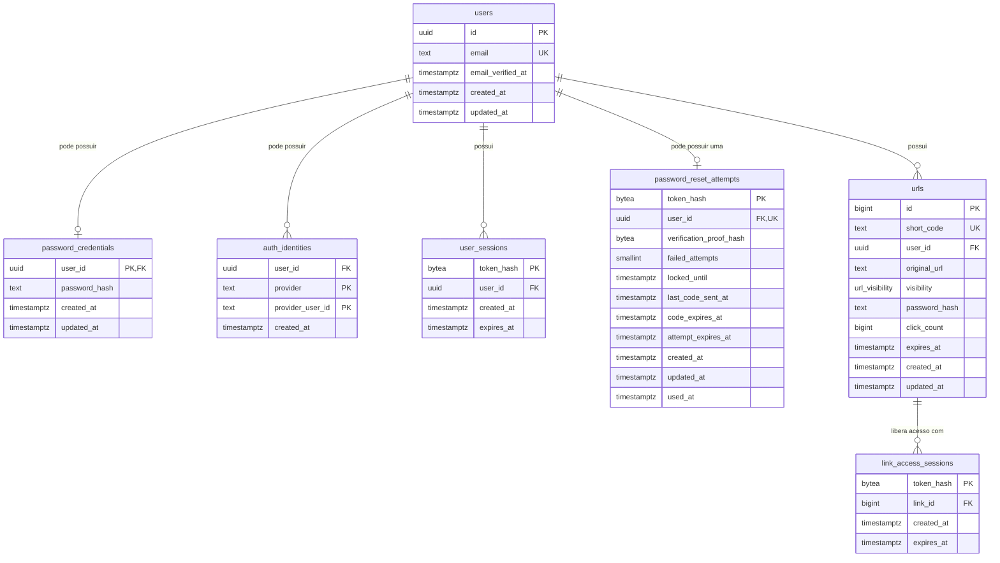
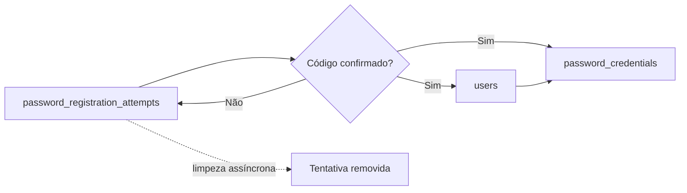
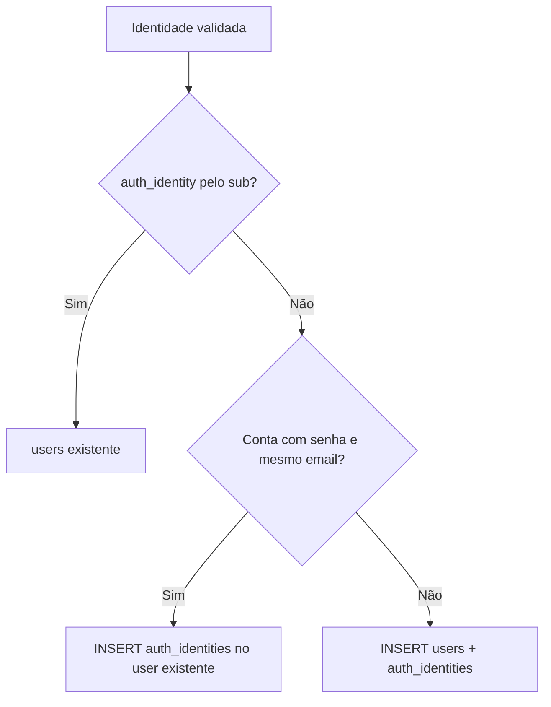
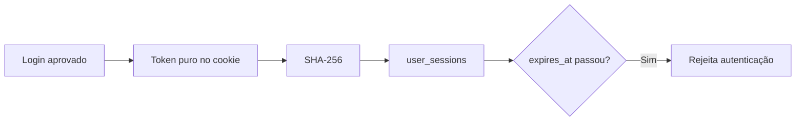

# Modelo de dados

> Status: migrations `00001` a `00006`
> Última atualização: 26 de setembro de 2026

PostgreSQL é a fonte da verdade. Tokens secretos são armazenados somente como hash.

## Diagrama



`password_registration_attempts` não aponta para `users`, pois representa um cadastro que ainda não virou conta.

## Ciclo de vida das contas

### Cadastro por senha



### Primeiro login Google



### Sessão



## Tabelas

### `users`

Identidade local principal. Usa UUIDv7, email canônico e email obrigatoriamente confirmado.

### `password_credentials`

Existe somente para contas capazes de entrar por senha. O hash usa Argon2id. Separar credencial de `users` permite contas Google-only sem coluna de senha nula ou artificial.

### `auth_identities`

Guarda identidades externas. Para Google:

```text
provider = google
provider_user_id = claim sub
```

A chave `(provider, provider_user_id)` identifica a conta externa. A constraint `(user_id, provider)` impede vincular duas contas do mesmo provedor ao mesmo usuário.

### `password_registration_attempts`

Guarda temporariamente cadastro ainda não confirmado, incluindo password hash, prova HMAC do código, cooldowns e prazos. Não concede autenticação.

### `user_sessions`

Guarda o hash de tokens opacos. O token puro só fica no cookie do cliente.

### `password_reset_attempts` 🚧

Há no máximo uma linha por usuário com senha. O token opaco fica no cookie e seu hash identifica a tentativa; `verification_proof_hash` guarda HMAC(token, código), nunca o código puro. O upsert respeita cooldown e bloqueio, troca o código sem estender a vida da tentativa ativa e reinicia os contadores apenas após a expiração. `used_at` permitirá impedir reutilização após a confirmação.

### `urls` 📋

O schema está pronto, mas o fluxo HTTP ainda não foi implementado. Links privados exigem `password_hash`; links públicos exigem que esse campo seja `NULL`.

### `link_access_sessions` 📋

Sessão temporária e específica de um link privado. Não substitui `user_sessions` e não autentica uma conta.

## Regras de exclusão

| Relação | Comportamento |
|---|---|
| Usuário → credenciais/identidades/sessões/reset | `ON DELETE CASCADE` |
| Usuário → URLs | `ON DELETE RESTRICT` |
| URL → sessões de acesso | `ON DELETE CASCADE` |

Não existe endpoint de exclusão de conta no MVP; essas regras protegem consistência futura.
