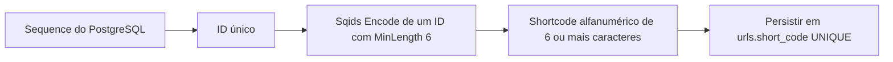
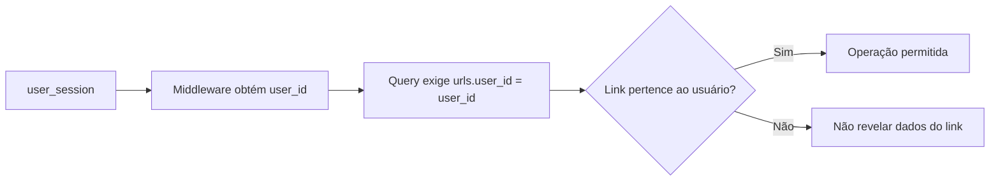
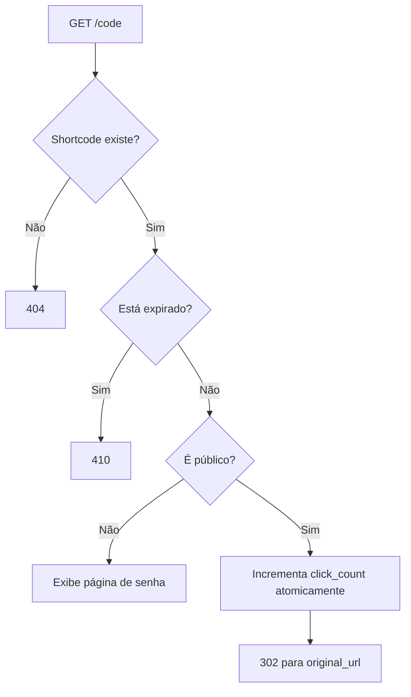
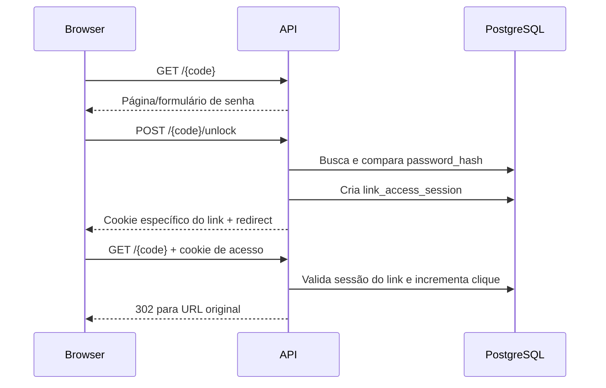
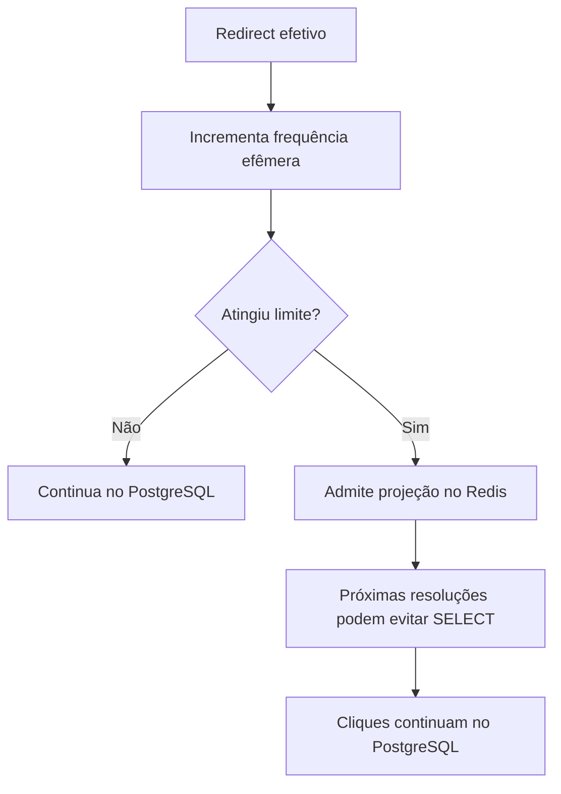

# Links e shortcodes

> Status: ID incremental + Sqids com comprimento mínimo de seis caracteres decidido; schema e gerador antigos ainda precisam ser adaptados; endpoints planejados
> Última atualização: 27 de setembro de 2026

## Objetivo do domínio

Cada URL curta pertence a um usuário autenticado e possui:

- shortcode público;
- URL original;
- visibilidade pública ou privada;
- senha opcional para links privados;
- expiração opcional;
- contador total de cliques;
- timestamps de criação e alteração.

## Estado atual

| Componente | Estado |
|---|---|
| Tabela `urls` | ✅ Implementada; constraint de comprimento ainda precisa mudar |
| Model `URL` | ✅ Implementado |
| Gerador Base62 aleatório de 10 caracteres | ✅ Existe, mas será substituído antes de `POST /urls` |
| Gerador Sqids com `MinLength: 6` | 📋 Decidido, ainda não implementado |
| Repository de URLs | 📋 Planejado |
| Service e handlers | 📋 Planejados |
| Rotas HTTP | 📋 Planejadas |
| Redis seletivo | 📋 Planejado para depois da versão PostgreSQL |
| Estratégia final de shortcode | ✅ Decidida: ID incremental + Sqids |

## Decisão para o shortcode

O PostgreSQL fornece `urls.id` incremental e único. O gerador usará a [implementação oficial de Sqids em Go](https://github.com/sqids/sqids-go) para codificar **um único número**, o ID positivo da URL, com `MinLength: 6`. Assim, todo código terá **pelo menos seis caracteres**, mas poderá ter sete ou mais; não há máximo configurável nem um ponto de crescimento definido por `62^6`. Usaremos inicialmente o alfabeto e a blocklist padrão da versão fixada da biblioteca, sem alfabeto secreto ou chave. O código resultante será persistido em `urls.short_code`.



Sqids garante códigos diferentes para entradas numéricas diferentes **sob a mesma configuração**. A biblioteca pode retornar erro de geração, por exemplo se uma blocklist excessivamente restritiva esgotar as tentativas; o service deverá propagá-lo, não ignorá-lo. `MinLength` acrescenta caracteres de preenchimento definidos pelo algoritmo, não zeros à esquerda como na conversão direta do número. O tamanho poderá crescer antes de se ocupar toda a combinação matemática de seis caracteres; não usar `62^6` como limite ou capacidade prometida por Sqids.

Sqids **não é criptografia** nem impede enumeração por alguém determinado. Um alfabeto customizado também não seria uma chave segura. Link privado depende de senha; ações administrativas dependem de autenticação e ownership. Rate limit no redirect limita abuso online, mas não transforma o shortcode em segredo. [FAQ oficial](https://sqids.org/faq).

Guardar `short_code` em coluna própria, com `UNIQUE` e imutável no MVP. O redirect consulta o valor exato (`WHERE short_code = ...`), sem decodificar o código para buscar pelo ID. Isso preserva links antigos se a biblioteca mudar e rejeita variantes não armazenadas; o `Decode` de Sqids não é canônico por si só. `UNIQUE` permanece como defesa contra bugs e mudanças incompatíveis de configuração; colisão não é parte esperada do fluxo normal, e não haverá retry aleatório.

Fixar a versão da dependência e manter alfabeto, `MinLength` e blocklist iguais entre instâncias. Uma atualização da biblioteca ou da blocklist pode alterar o código gerado para o mesmo ID; códigos antigos continuam resolvíveis por lookup exato, mas a geração de novos códigos pode conflitar com eles. Antes de atualizar a dependência/configuração, comparar vetores de regressão e planejar qualquer incompatibilidade. No primeiro passo da implementação, registrar explicitamente a configuração efetiva e os vetores da versão escolhida. Não há chave criptográfica.

O ID interno continua `BIGINT` positivo; não há corte em seis caracteres. Deletar links não recupera IDs da sequence, e rollbacks podem deixar lacunas. Validar a conversão do ID SQL para o `uint64` exigido pela API Go de Sqids e tratar erros de codificação explicitamente.

Quando autorizada a implementação, mudar `migrations/00003_create_urls.sql`: substituir o mínimo atual de oito caracteres por **mínimo seis, sem máximo fixo**, mantendo validação alfanumérica e `UNIQUE`. O gerador atual em `internal/shortcodes/generator.go` ainda produz dez caracteres aleatórios e seus testes refletem a estratégia antiga; ambos devem ser substituídos. Ainda não há repository/service/handler de criação de URLs para migrar. **Nenhuma migration ou código foi alterado nesta etapa documental.**

## Criação de URL 📋


Como `short_code` é `NOT NULL` e depende do ID, o repository precisará obter o próximo ID da sequence **antes** do `INSERT`. Uma solução a validar por teste de integração é reservar o ID com `nextval(pg_get_serial_sequence('urls', 'id'))` e inserir o ID explícito usando `OVERRIDING SYSTEM VALUE`; isso preserva o `NOT NULL`. Lacunas na sequence após falhas são normais. Validar concorrência, ID positivo, falhas de `Encode` e erros inesperados de `UNIQUE`.

## Ownership

Autenticação responde “quem é o usuário”. Autorização responde “este usuário pode operar este link?”.



Endpoints administrativos nunca confiarão em um `user_id` enviado pelo cliente.

## Endpoints administrativos planejados

| Endpoint | Função |
|---|---|
| `POST /urls` | Criar link público ou privado |
| `GET /urls?limit=...&cursor=...` | Listar somente links do usuário |
| `GET /urls/{code}` | Consultar metadados e analytics com ownership |

A listagem usará paginação por cursor baseada em `(created_at, id)`, evitando paginação instável por offset.

## Redirect público 📋



O clique só será contado quando o sistema realmente realizar o redirect.

O incremento deve ser atômico no PostgreSQL:

```sql
UPDATE urls
SET click_count = click_count + 1
WHERE id = $1;
```

Não será usado o fluxo vulnerável `SELECT → incrementar em Go → UPDATE`.

## Link privado e desbloqueio 📋



O cookie de acesso a link privado não autentica a conta e só libera o link ao qual foi associado.

## Expiração

`expires_at = NULL` representa link sem expiração. Quando preenchido, precisa ser posterior à criação. Um link expirado não redireciona nem incrementa `click_count`.

## Analytics

O MVP começa com `click_count` total. A consulta administrativa exige que `urls.user_id` seja o usuário autenticado.

Analytics por evento, localização, dispositivo ou série temporal ficam fora do MVP.

## Cache seletivo futuro

O PostgreSQL será implementado e medido antes do Redis.



Redis será uma otimização de leitura. Se estiver indisponível, a aplicação volta ao PostgreSQL.
