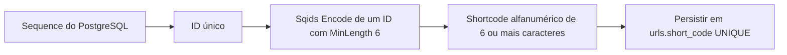
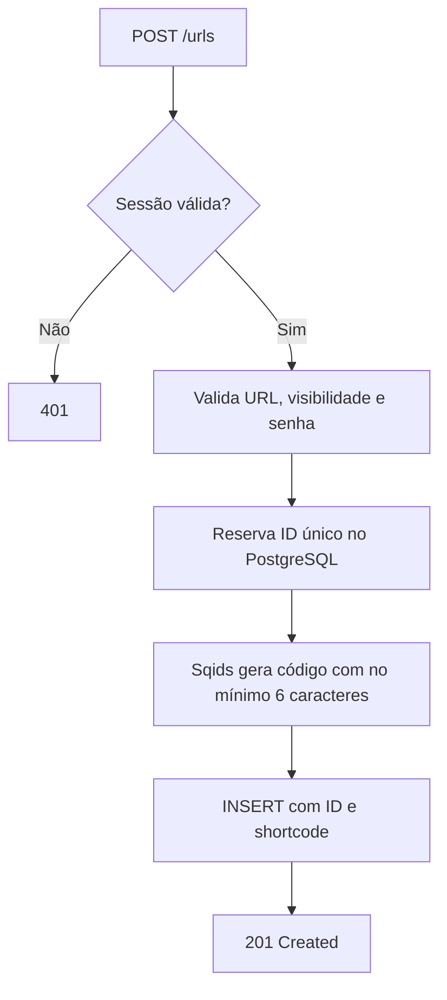
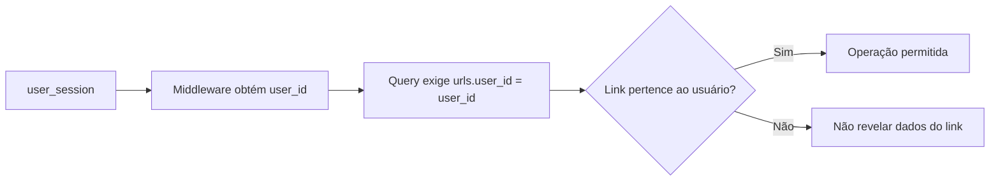
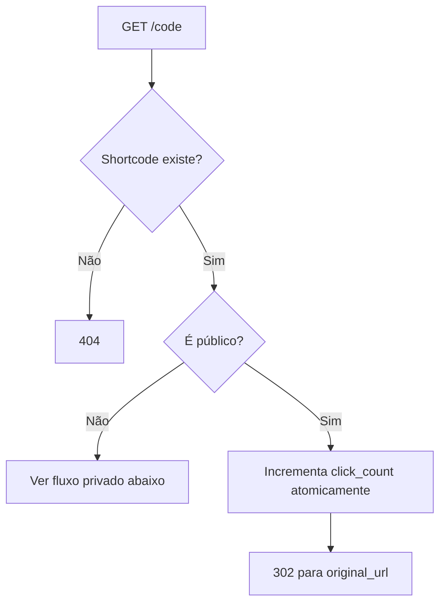
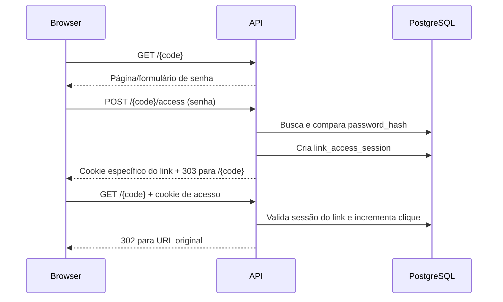
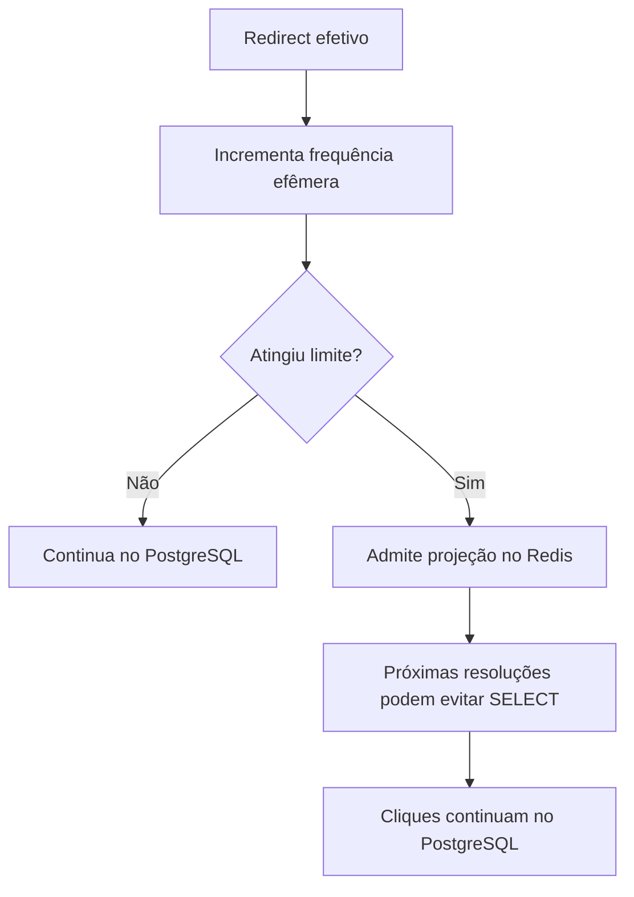

# Links e shortcodes

> Status: geração Sqids, criação, listagem, metadados individuais e redirects público/privado com contador implementados
> Última atualização: 29 de setembro de 2026

## Objetivo do domínio

Cada URL curta pertence a um usuário autenticado e possui:

- shortcode público;
- URL original;
- visibilidade pública ou privada;
- senha opcional para links privados;
- contador total de cliques;
- timestamps de criação e alteração.

## Estado atual

| Componente | Estado |
|---|---|
| Tabela `urls` | ✅ Implementada, com mínimo de seis caracteres e sem expiração |
| Model `URL` | ✅ Implementado |
| Gerador Sqids com `MinLength: 6` | ✅ Implementado |
| Repository de URLs | ✅ Reserva ID, cria, consulta e lista por owner/cursor; resolve links públicos/privados e conta clique |
| Service e handlers | ✅ Criação, listagem, consulta individual, redirects e desbloqueio privado |
| Rotas HTTP | ✅ `POST /urls`, `GET /urls` e `GET /urls/{code}` autenticadas; `GET /{code}` e `POST /{code}/access` públicas |
| Redis seletivo | 📋 Planejado para depois da versão PostgreSQL |
| Estratégia final de shortcode | ✅ Decidida: ID incremental + Sqids |

## Decisão para o shortcode

O PostgreSQL fornece `urls.id` incremental e único. O gerador usa a [implementação oficial de Sqids em Go](https://github.com/sqids/sqids-go) para codificar **um único número**, o ID positivo da URL, com `MinLength: 6`. Assim, todo código tem **pelo menos seis caracteres**, mas poderá ter sete ou mais; não há máximo configurável nem um ponto de crescimento definido por `62^6`. Usamos o alfabeto e a blocklist padrão da versão fixada da biblioteca, sem alfabeto secreto ou chave. O código resultante é persistido em `urls.short_code`.



Sqids garante códigos diferentes para entradas numéricas diferentes **sob a mesma configuração**. A biblioteca pode retornar erro de geração, por exemplo se uma blocklist excessivamente restritiva esgotar as tentativas; o service propaga esse erro. `MinLength` acrescenta caracteres de preenchimento definidos pelo algoritmo, não zeros à esquerda como na conversão direta do número. O tamanho poderá crescer antes de se ocupar toda a combinação matemática de seis caracteres; não usar `62^6` como limite ou capacidade prometida por Sqids.

Sqids **não é criptografia** nem impede enumeração por alguém determinado. Um alfabeto customizado também não seria uma chave segura. Link privado depende de senha; ações administrativas dependem de autenticação e ownership. Rate limit no redirect limita abuso online, mas não transforma o shortcode em segredo. [FAQ oficial](https://sqids.org/faq).

Guardar `short_code` em coluna própria, com `UNIQUE` e imutável no MVP. O redirect consulta o valor exato (`WHERE short_code = ...`), sem decodificar o código para buscar pelo ID. Isso preserva links antigos se a biblioteca mudar e rejeita variantes não armazenadas; o `Decode` de Sqids não é canônico por si só. `UNIQUE` permanece como defesa contra bugs e mudanças incompatíveis de configuração; colisão não é parte esperada do fluxo normal, e não haverá retry aleatório.

A versão da dependência está fixada, e alfabeto, `MinLength` e blocklist devem permanecer iguais entre instâncias. Uma atualização da biblioteca ou da blocklist pode alterar o código gerado para o mesmo ID; códigos antigos continuam resolvíveis por lookup exato, mas a geração de novos códigos pode conflitar com eles. Antes de atualizar a dependência/configuração, comparar os vetores de regressão já testados e planejar qualquer incompatibilidade. Não há chave criptográfica.

O ID interno continua `BIGINT` positivo; não há corte em seis caracteres. Deletar links não recupera IDs da sequence, e rollbacks podem deixar lacunas. Validar a conversão do ID SQL para o `uint64` exigido pela API Go de Sqids e tratar erros de codificação explicitamente.

`migrations/00003_create_urls.sql` aceita códigos com **mínimo seis, sem máximo fixo**, mantendo validação alfanumérica e `UNIQUE`. `internal/shortcodes/generator.go` codifica IDs com Sqids. Repository, service, handler e rota autenticada de criação já estão implementados.

## Criação de URL ✅



Como `short_code` é `NOT NULL` e depende do ID, o repository obtém o próximo ID da sequence **antes** do `INSERT` com `nextval(pg_get_serial_sequence('urls', 'id'))` e insere o ID explícito usando `OVERRIDING SYSTEM VALUE`; a sintaxe foi validada em teste de integração. Lacunas na sequence após falhas são normais. O gerador valida ID positivo; erros inesperados de `UNIQUE` são propagados, sem retry aleatório.

## Ownership

Autenticação responde “quem é o usuário”. Autorização responde “este usuário pode operar este link?”.



Endpoints administrativos nunca confiarão em um `user_id` enviado pelo cliente.

## Endpoints administrativos

| Endpoint | Função |
|---|---|
| `POST /urls` | ✅ Criar link público ou privado |
| `GET /urls?limit=...&cursor=...` | ✅ Listar somente links do usuário |
| `GET /urls/{code}` | ✅ Consultar metadados e contador de cliques com ownership |

A listagem usa paginação keyset por `(created_at DESC, id DESC)`, evitando `OFFSET`. `limit` assume 20 quando omitido e aceita de 1 a 20. A consulta pede `limit+1` para detectar a próxima página; o item extra não é enviado. `next_cursor` é uma string Base64URL sem padding que codifica `created_at` e `id` do último link entregue, ou `null` no fim. É apenas posição, não autenticação nem criptografia. A query sempre filtra `user_id` da sessão; a resposta não contém senha nem hash. O contrato JSON está em [API HTTP](api.md).

A consulta individual usa `short_code` e `user_id` na mesma query. Assim,
um código inexistente e um link de outro usuário resultam no mesmo `404`.
Ela retorna os metadados e o contador de cliques ao dono, sem hash da senha.

## Redirect público ✅



`GET /{code}` não exige login. Código inexistente retorna `404`; link privado sem sessão válida mostra a página de senha descrita abaixo. O clique só é contado quando o link público é resolvido e o servidor consegue persistir o incremento antes de responder com o redirect.

O repository faz a resolução e o incremento em uma operação atômica no PostgreSQL:

```sql
UPDATE urls
SET click_count = click_count + 1
WHERE short_code = @shortCode AND visibility = 'public'
RETURNING original_url;
```

Não há o fluxo vulnerável `SELECT → incrementar em Go → UPDATE`. A resposta usa `302 Found` com `Location` apontando para a URL original e `Cache-Control: no-store`, para que o navegador não guarde o redirect e os acessos seguintes voltem à API. O rate limit global continua aplicado. Testes cobrem redirecionamento HTTP sem login, contador após acessos repetidos, `404` para código inexistente e incrementos concorrentes.

## Link privado e desbloqueio ✅



`GET /{code}` mostra HTML com formulário quando o link privado não tem uma sessão válida. O `POST` recebe `application/x-www-form-urlencoded` com o campo `password`. Senha incorreta reapresenta o formulário com `401`, sem criar sessão nem contar clique. Senha correta cria `link_access_session` no PostgreSQL, define o cookie `link_access_session` com `HttpOnly`, `SameSite=Lax`, `Path=/{code}` e `Secure` em HTTPS, e responde `303` para o mesmo shortcode.

O TTL padrão da sessão é **30 minutos**, configurável por `LINK_ACCESS_SESSION_TTL`; não há renovação automática. O cookie não autentica a conta. No GET seguinte, o servidor verifica se o hash do token pertence ao `link_id` e se a sessão não expirou; somente então incrementa o clique e responde `302`. Mesmo se um cliente anexar manualmente o cookie a outro link, ele não é aceito. O POST possui rate limit em memória por IP + shortcode, com burst de 5 e reposição de 20 tentativas por minuto, antes da comparação Argon2id. Teste de integração cobre senha errada, cookie, isolamento entre dois links, expiração e contador.

## Duração dos links

URLs criadas não expiram automaticamente. A sessão temporária usada para desbloquear um link privado continua tendo expiração própria, mas isso não remove nem desativa a URL.

## Analytics

O MVP começa com `click_count` total. A consulta administrativa exige que `urls.user_id` seja o usuário autenticado.

Analytics por evento, localização, dispositivo ou série temporal ficam fora do MVP.

## Cache seletivo futuro

O redirect e o contador já usam PostgreSQL; o Redis virá depois de medir esse fluxo.



Redis será uma otimização de leitura. Se estiver indisponível, a aplicação volta ao PostgreSQL.
