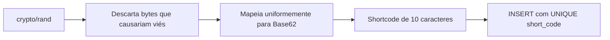
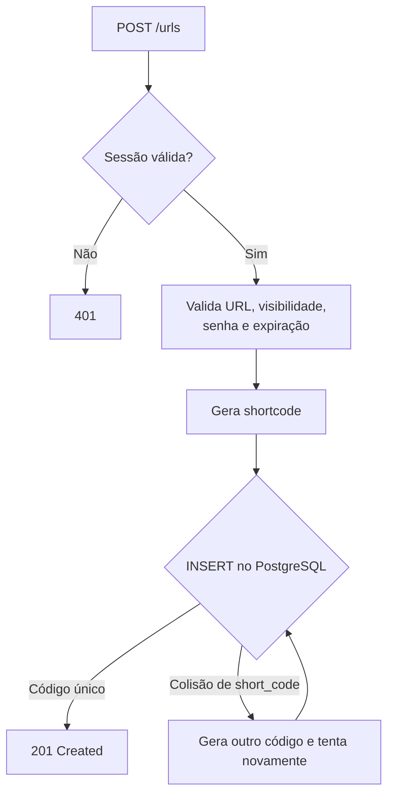
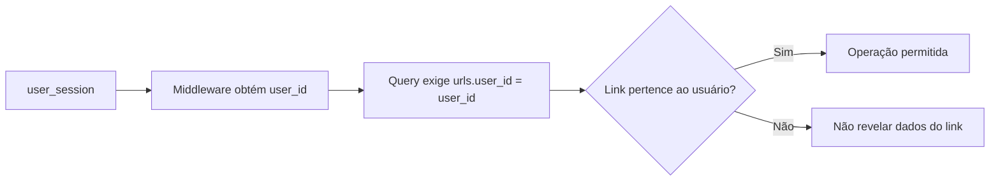
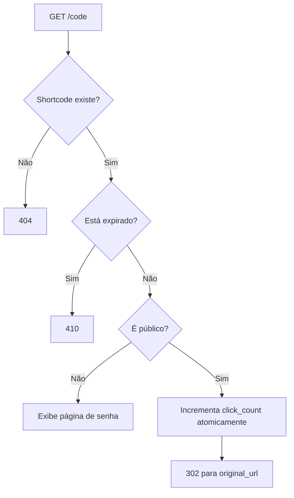
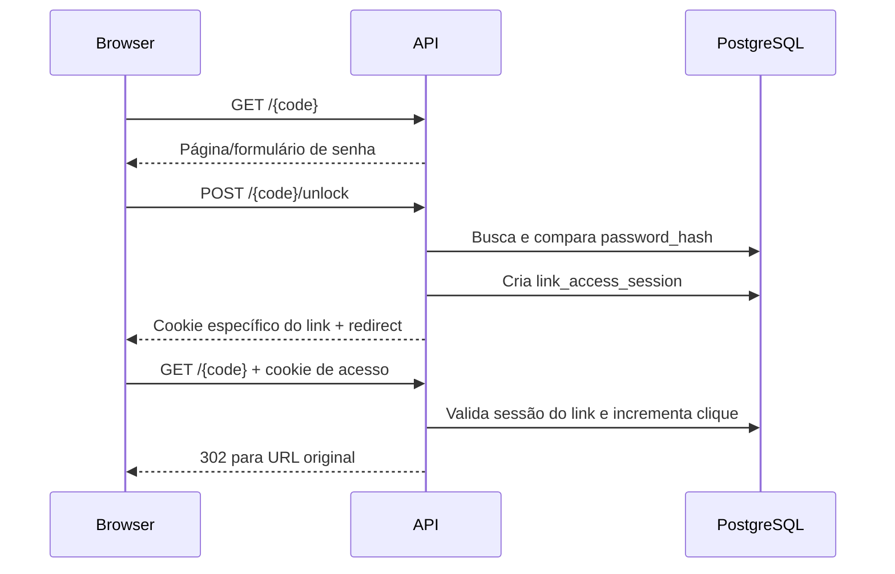
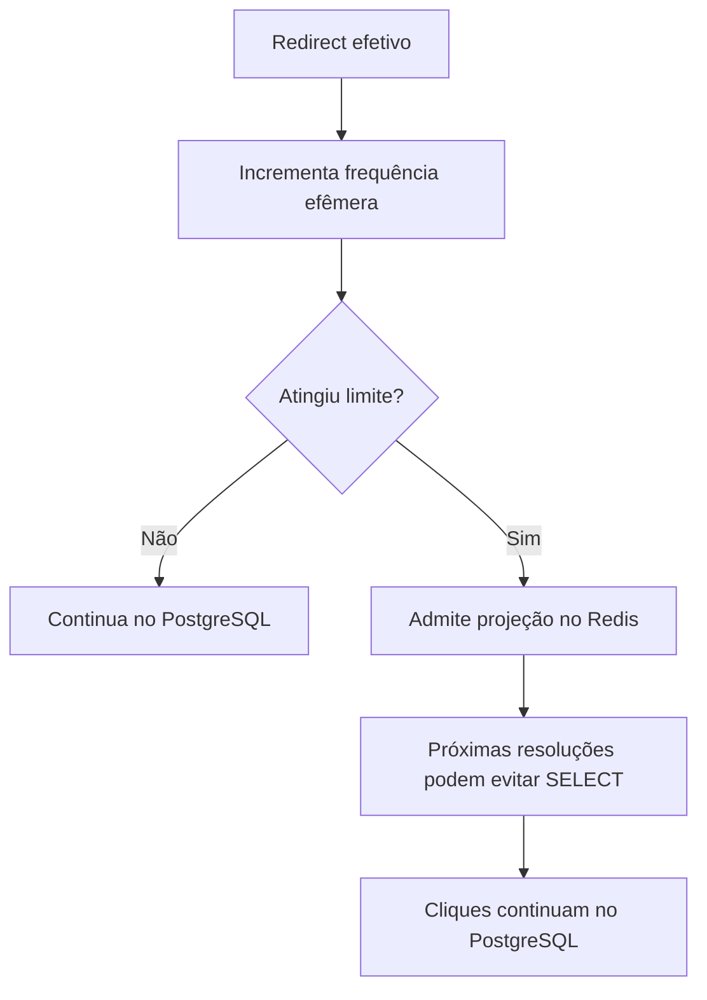

# Links e shortcodes

> Status: schema e gerador implementados; endpoints ainda planejados
> Última atualização: 24 de setembro de 2026

## Objetivo do domínio

Cada URL curta pertence a um usuário autenticado e possui:

- shortcode público;
- URL original;
- visibilidade pública ou privada;
- senha opcional para links privados;
- expiração opcional;
- contador total de cliques;
- timestamps de criação e alteração.

## Estado atual

| Componente | Estado |
|---|---|
| Tabela `urls` | ✅ Implementada |
| Model `URL` | ✅ Implementado |
| Gerador Base62 aleatório | ✅ Implementado e testado |
| Repository de URLs | 📋 Planejado |
| Service e handlers | 📋 Planejados |
| Rotas HTTP | 📋 Planejadas |
| Redis seletivo | 📋 Planejado para depois da versão PostgreSQL |
| Estratégia final de shortcode | ⏸️ Decisão adiada |

## Modelo atual do shortcode

O código existente gera dez caracteres usando:

```text
0123456789ABCDEFGHIJKLMNOPQRSTUVWXYZabcdefghijklmnopqrstuvwxyz
```

O gerador usa `crypto/rand` e amostragem por rejeição para evitar viés na distribuição. A tabela mantém `UNIQUE(short_code)`, que será a garantia definitiva contra persistir duplicatas.



Foi discutida a alternativa Sqids derivada do `id` incremental. A decisão está pausada. Nenhuma mudança deve ser feita até avaliar novamente enumeração, estabilidade da configuração e necessidade de persistir o shortcode.

## Criação de URL 📋



O retry deverá ser limitado e acontecer somente para a constraint específica de `short_code`. Outros erros do banco não são colisões e devem ser propagados.

## Ownership

Autenticação responde “quem é o usuário”. Autorização responde “este usuário pode operar este link?”.



Endpoints administrativos nunca confiarão em um `user_id` enviado pelo cliente.

## Endpoints administrativos planejados

| Endpoint | Função |
|---|---|
| `POST /urls` | Criar link público ou privado |
| `GET /urls?limit=...&cursor=...` | Listar somente links do usuário |
| `GET /urls/{code}` | Consultar metadados e analytics com ownership |

A listagem usará paginação por cursor baseada em `(created_at, id)`, evitando paginação instável por offset.

## Redirect público 📋



O clique só será contado quando o sistema realmente realizar o redirect.

O incremento deve ser atômico no PostgreSQL:

```sql
UPDATE urls
SET click_count = click_count + 1
WHERE id = $1;
```

Não será usado o fluxo vulnerável `SELECT → incrementar em Go → UPDATE`.

## Link privado e desbloqueio 📋



O cookie de acesso a link privado não autentica a conta e só libera o link ao qual foi associado.

## Expiração

`expires_at = NULL` representa link sem expiração. Quando preenchido, precisa ser posterior à criação. Um link expirado não redireciona nem incrementa `click_count`.

## Analytics

O MVP começa com `click_count` total. A consulta administrativa exige que `urls.user_id` seja o usuário autenticado.

Analytics por evento, localização, dispositivo ou série temporal ficam fora do MVP.

## Cache seletivo futuro

O PostgreSQL será implementado e medido antes do Redis.



Redis será uma otimização de leitura. Se estiver indisponível, a aplicação volta ao PostgreSQL.
