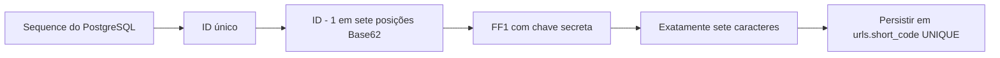
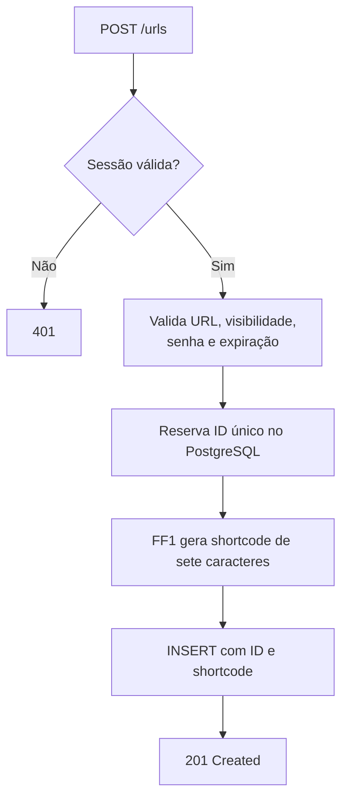
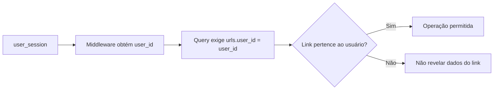
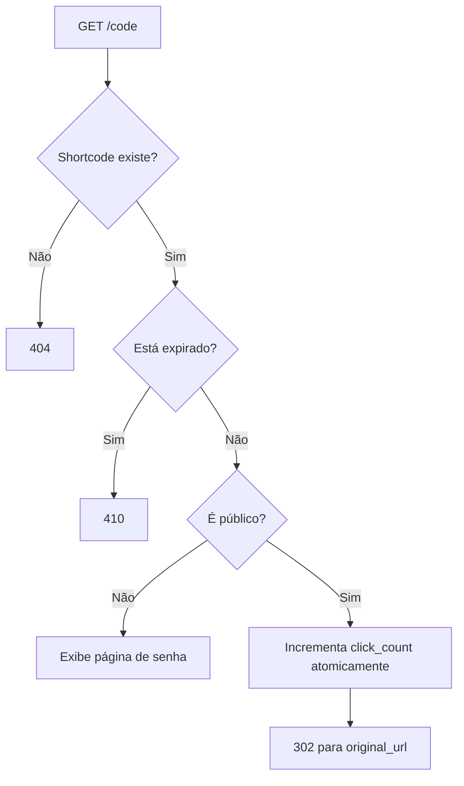
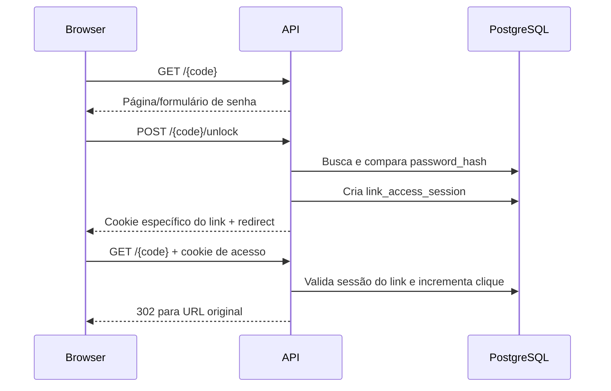
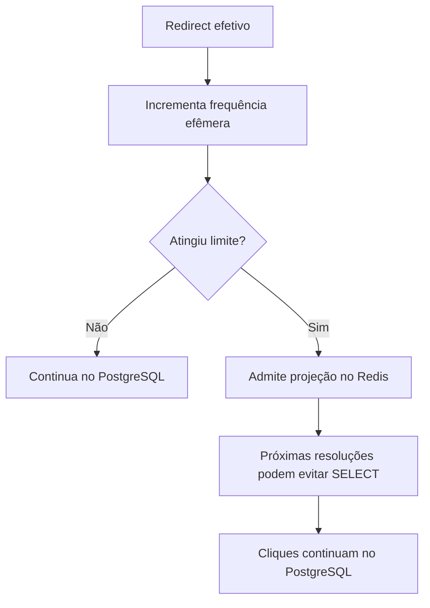

# Links e shortcodes

> Status: estratégia FF1 de sete caracteres decidida; schema e gerador antigos ainda precisam ser adaptados; endpoints planejados
> Última atualização: 26 de setembro de 2026

## Objetivo do domínio

Cada URL curta pertence a um usuário autenticado e possui:

- shortcode público;
- URL original;
- visibilidade pública ou privada;
- senha opcional para links privados;
- expiração opcional;
- contador total de cliques;
- timestamps de criação e alteração.

## Estado atual

| Componente | Estado |
|---|---|
| Tabela `urls` | ✅ Implementada; constraint de comprimento ainda precisa mudar |
| Model `URL` | ✅ Implementado |
| Gerador Base62 aleatório de 10 caracteres | ✅ Existe, mas será substituído antes de `POST /urls` |
| Codec FF1 de sete caracteres | 📋 Decidido, ainda não implementado |
| Repository de URLs | 📋 Planejado |
| Service e handlers | 📋 Planejados |
| Rotas HTTP | 📋 Planejadas |
| Redis seletivo | 📋 Planejado para depois da versão PostgreSQL |
| Estratégia final de shortcode | ✅ Decidida: ID incremental + FF1 + Base62 fixo |

## Decisão para o shortcode

Todo shortcode terá **exatamente sete caracteres**, nem menos nem mais, usando o alfabeto canônico:

```text
0123456789ABCDEFGHIJKLMNOPQRSTUVWXYZabcdefghijklmnopqrstuvwxyz
```

O PostgreSQL fornece `urls.id` incremental e único. Para um ID `id` começando em 1, converter `id - 1` para uma representação Base62 de sete posições; aplicar **FF1** (criptografia de formato preservado) com uma chave secreta estável; persistir os sete caracteres resultantes em `urls.short_code`. O preenchimento inicial da representação não aparece como prefixo fixo no resultado criptografado. Não truncar a saída e não usar Sqids: `MinLength: 7` do Sqids não garante máximo de sete caracteres.



`62^7 = 3.521.614.606.208` é o tamanho do domínio. Aceitar somente IDs de 1 até esse valor, inclusive. Se a sequence avançar além do domínio, **recusar a criação**; nunca reutilizar ID, cortar código ou emitir oito caracteres. Deletar links antigos não reinicia a sequence, e inserções abortadas podem deixar lacunas. O limite é de IDs emitidos ao longo da vida da instalação, não de links ativos.

Com chave, parâmetros e versão do algoritmo fixos, FF1 é uma permutação do domínio: IDs distintos não geram o mesmo código. O objetivo criptográfico é impedir que alguém derive todos os outros códigos a partir de um código observado e da natureza incremental dos IDs. Não é uma garantia de que ninguém adivinhará um código de sete caracteres por força bruta, nem substitui senha de link privado, ownership ou rate limit. Uma chave ou banco vazados também expõem os links. A implementação deverá usar uma biblioteca FF1 confiável e testada; **não criar criptografia própria**.

Guardar `short_code` em coluna própria, com `UNIQUE` e imutável no MVP. O redirect consulta o valor exato (`WHERE short_code = ...`), sem fazer decode do código para buscar pelo ID. Isso preserva links antigos se o codec mudar e rejeita naturalmente strings alternativas. A constraint `UNIQUE` permanece como defesa contra bugs e conflitos entre versões de chave/configuração; colisão não é parte esperada do fluxo normal, e não haverá retry aleatório.

Chave, alfabeto, parâmetros de FF1 e eventual tweak precisam ser consistentes entre instâncias e deploys. A chave será fornecida por configuração externa, nunca commitada ou registrada em log, e terá backup seguro. Rotacioná-la exige um plano explícito para novos links e checagem de conflito com códigos existentes; **não** basta trocar a variável de ambiente. O nome/formato da configuração e a biblioteca Go serão fechados na implementação. O alfabeto não é secreto; a chave é.

Antes de codificar o codec, alterar `migrations/00003_create_urls.sql`: substituir `CHAR_LENGTH(short_code) >= 8` por `CHAR_LENGTH(short_code) = 7` e renomear a constraint `chk_urls_short_code_min_length` para refletir a nova regra, mantendo a validação Base62 e `UNIQUE`. O gerador atual em `internal/shortcodes/generator.go` ainda produz dez caracteres aleatórios e seus testes refletem a estratégia antiga; ambos devem ser substituídos. Ainda não há repository/service/handler de criação de URLs para migrar.

## Criação de URL 📋



Como `short_code` é `NOT NULL` e depende do ID, o repository precisará obter o próximo ID da sequence **antes** do `INSERT`. Uma solução a validar por teste de integração é reservar o ID com `nextval(pg_get_serial_sequence('urls', 'id'))` e inserir o ID explícito usando `OVERRIDING SYSTEM VALUE`; isso preserva o `NOT NULL`. Lacunas na sequence após falhas são normais. Validar também concorrência, limite do domínio e erros inesperados de `UNIQUE`.

## Ownership

Autenticação responde “quem é o usuário”. Autorização responde “este usuário pode operar este link?”.



Endpoints administrativos nunca confiarão em um `user_id` enviado pelo cliente.

## Endpoints administrativos planejados

| Endpoint | Função |
|---|---|
| `POST /urls` | Criar link público ou privado |
| `GET /urls?limit=...&cursor=...` | Listar somente links do usuário |
| `GET /urls/{code}` | Consultar metadados e analytics com ownership |

A listagem usará paginação por cursor baseada em `(created_at, id)`, evitando paginação instável por offset.

## Redirect público 📋



O clique só será contado quando o sistema realmente realizar o redirect.

O incremento deve ser atômico no PostgreSQL:

```sql
UPDATE urls
SET click_count = click_count + 1
WHERE id = $1;
```

Não será usado o fluxo vulnerável `SELECT → incrementar em Go → UPDATE`.

## Link privado e desbloqueio 📋



O cookie de acesso a link privado não autentica a conta e só libera o link ao qual foi associado.

## Expiração

`expires_at = NULL` representa link sem expiração. Quando preenchido, precisa ser posterior à criação. Um link expirado não redireciona nem incrementa `click_count`.

## Analytics

O MVP começa com `click_count` total. A consulta administrativa exige que `urls.user_id` seja o usuário autenticado.

Analytics por evento, localização, dispositivo ou série temporal ficam fora do MVP.

## Cache seletivo futuro

O PostgreSQL será implementado e medido antes do Redis.



Redis será uma otimização de leitura. Se estiver indisponível, a aplicação volta ao PostgreSQL.
